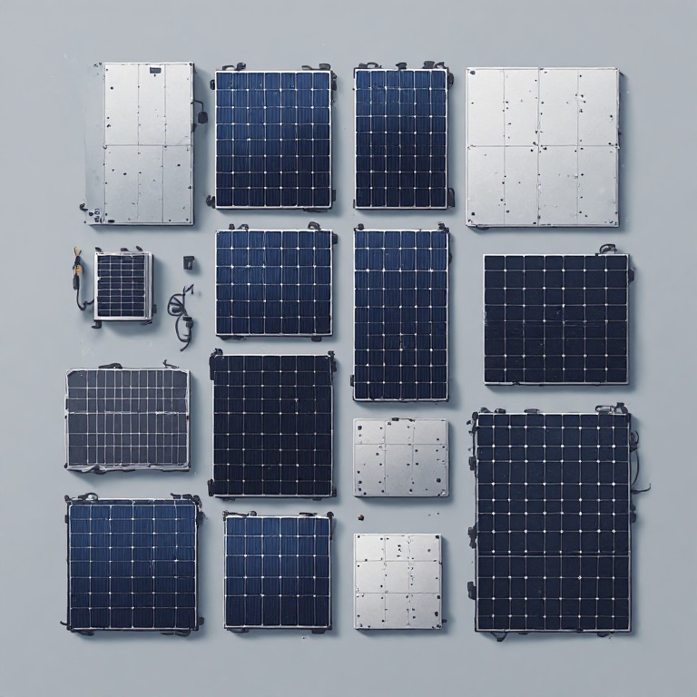
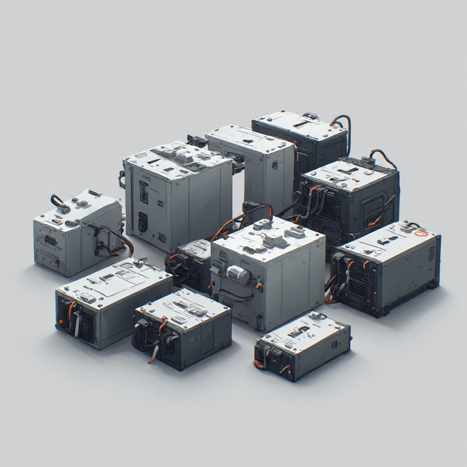
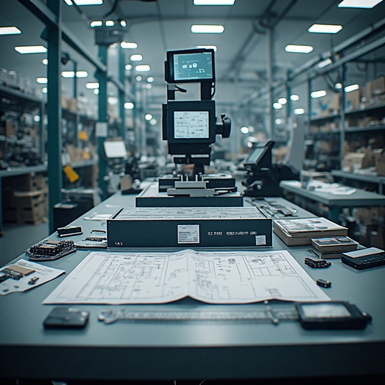
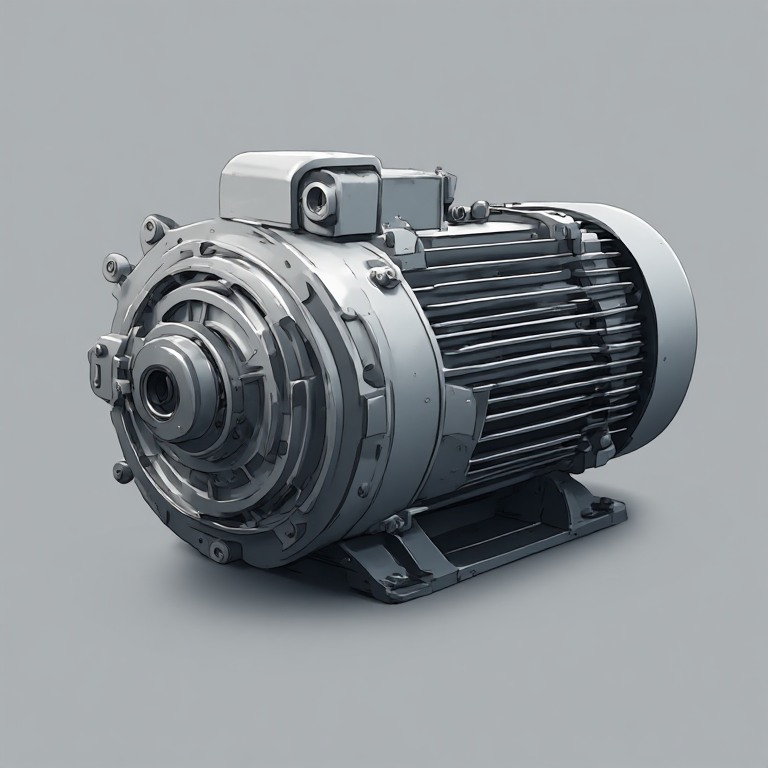
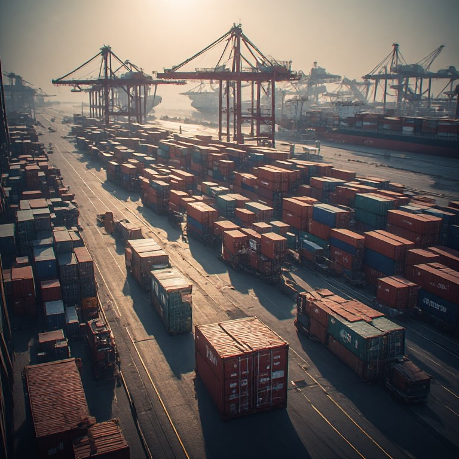
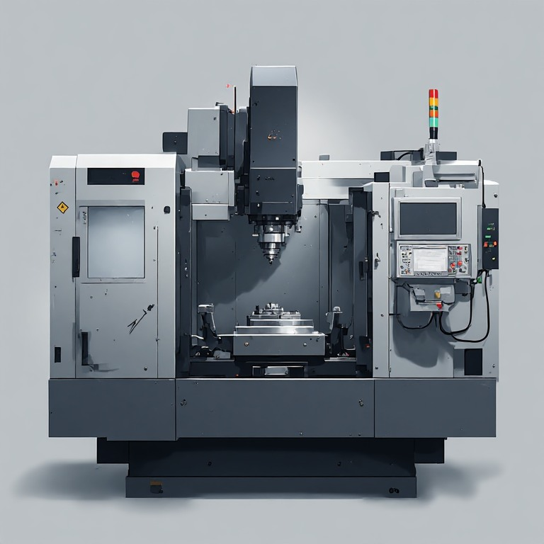

# Find a business partner you can trust.



## 🌏 Doing Business With China

> 💭 I can find a supplier.
>
> 💭 I can find a factory.
>
> 💭 I can find a product.
>
> 💭 I can get a quotation.
>
> 💭 I can send messages.
>
> 💭 I can order samples.
>
> 💭 I can even make a payment.
>
> 💭 But can I find a business partner I can actually trust?

---

# 🧠 Everything Looks Fine

💭 The company has a website.

💭 The salesperson responds quickly.

💭 The product photos look professional.

💭 The quotation looks reasonable.

💭 The supplier says they are a manufacturer.

💭 They sent me factory photos.

💭 They sent me videos.

💭 They sent me certificates.

💭 They answered my questions.

💭 They sent me a sample.

💭 The sample looks good.

💭 We agreed on the price.

💭 We agreed on the specifications.

💭 We agreed on the delivery date.

💭 Everything seems normal.

And yet I still have one question:

> 💭 **What exactly do I know, and what am I simply assuming?**

---

# 🔎 What Have I Actually Verified?

💭 I verified that the company exists.

💭 But did I verify that the company I found is the company I am actually dealing with?

💭 I verified the salesperson.

💭 But does that person actually represent the company?

💭 I verified the company name.

💭 Does the payment account belong to the same company?

💭 I verified the factory address.

💭 Is that really where my products will be manufactured?

💭 I verified the supplier.

💭 Is the supplier actually the manufacturer?

💭 Or is it a trading company?

💭 An agent?

💭 Another intermediary?

💭 I saw a factory.

💭 But was it really the factory producing my order?

💭 I saw a production line.

💭 But was my product actually being produced there?

💭 I received documents.

💭 Do those documents actually apply to my exact product?

💭 I received certificates.

💭 Are they current?

💭 Are they relevant?

💭 Are they connected to the product I am buying?

💭 I found positive information online.

💭 But what information am I not seeing?

---

# 🏭 Is This Really My Factory?



💭 The supplier says, "We are the factory."

💭 How do I independently verify that?

💭 How much of the production is actually done in-house?

💭 Which parts are outsourced?

💭 Who makes the critical components?

💭 Who controls production?

💭 Who controls quality?

💭 Who owns the machinery?

💭 Who owns the tooling?

💭 Where will my order actually be produced?

💭 Can the factory really handle my order volume?

💭 Can they produce 100 units?

💭 Can they produce 1,000 units?

💭 Can they produce 10,000 units?

💭 What happens when my order becomes larger?

💭 Will I still receive the same attention and quality?

💭 What happens if production is moved somewhere else?

💭 What happens if another factory becomes involved?

💭 What happens if I cannot physically visit the factory myself?

---

# 📋 I Don't Just Need a Supplier

💭 I need the right supplier for my product.

💭 I need a supplier that understands my specifications.

💭 I need a supplier that can meet my required quality.

💭 I need a supplier that can meet my required quantity.

💭 I need a supplier that can meet my deadline.

💭 I need a supplier whose production capability matches my requirements.

💭 I need a supplier whose business model makes sense for my order size.

💭 I need to know whether I am talking to the manufacturer or another layer in the supply chain.

💭 I don't want to choose a supplier simply because their website looks better.

💭 I don't want to choose a supplier simply because their price is lower.

💭 I don't want to choose a supplier simply because someone online recommended them.

💭 I want evidence that is relevant to my actual order.

---

# 💰 The Cheapest Price Is Not Always the Cheapest Order

💭 One supplier quoted $1.20.

💭 Another quoted $1.80.

💭 Another quoted $3.40.

💭 Why are they so different?

💭 Are they quoting the same material?

💭 Are they quoting the same dimensions?

💭 Are they quoting the same components?

💭 Are they quoting the same packaging?

💭 Are they including the same services?

💭 Are they using the same production process?

💭 Is tooling included?

💭 Is inspection included?

💭 Is domestic transportation included?

💭 Is international transportation included?

💭 Are duties included?

💭 Are taxes included?

💭 Are customs charges included?

💭 What will the product actually cost when it reaches my warehouse?

---

# 🧮 I Need the Real Cost

💭 I don't just want the factory price.

💭 I want to understand my landed cost.

💭 I want to know what I will actually pay.

💭 I want to know which costs are included.

💭 I want to know which costs are excluded.

💭 I want to know which costs can change.

💭 I want to know which costs I am responsible for.

💭 I want to know which costs the supplier is responsible for.

💭 I want to know whether a $10,000 order can become a $13,000 order after everything is included.

💭 I don't want to discover the real cost after the shipment has already left China.

---

# 📦 I Don't Want to Buy Inventory I Don't Need

💭 The supplier wants an MOQ of 10,000 units.

💭 I only need 1,000.

💭 I don't want to spend money on 9,000 units I cannot sell.

💭 Is the MOQ genuinely fixed?

💭 Could another factory accept a smaller order?

💭 Could another production method reduce the MOQ?

💭 Should I negotiate?

💭 Should I find another factory?

💭 What will my real inventory risk be?

---

# 🧪 I Need a Sample



💭 I want to see the product before I place a large order.

💭 I want to know exactly what I am approving.

💭 I want the sample to represent the actual production process.

💭 I want the materials to be the same.

💭 I want the dimensions to be the same.

💭 I want the components to be the same.

💭 I want the packaging to be the same.

💭 I want the finishing to be the same.

💭 I want the production version to match what I approved.

---

# ⚠️ The Sample Is Good. Now I Am More Concerned.

💭 The sample looks perfect.

💭 But one good sample only proves that one good sample exists.

💭 What guarantees that 5,000 units will be consistent?

💭 What happens if the factory changes the material?

💭 What happens if a component becomes unavailable?

💭 What happens if production is outsourced?

💭 What happens if a different worker produces the next batch?

💭 What happens if the factory considers a small difference acceptable?

💭 What exactly defines "the same product"?

💭 What exactly defines "acceptable quality"?

---

# 📐 I Need My Specifications to Mean the Same Thing to Everyone

💭 I have drawings.

💭 I have dimensions.

💭 I have technical requirements.

💭 I have reference photos.

💭 I have material requirements.

💭 I have packaging requirements.

💭 I have quality requirements.

💭 I have tolerances.

💭 I have details that matter.

💭 I need the factory to understand all of them.

💭 I need the salesperson to understand them.

💭 I need production to understand them.

💭 I need inspection to understand them.

💭 I need the final specification to be clear enough that nobody can reinterpret it later.

---

# 🌐 Language Is Not the Same as Understanding

💭 We can communicate in English.

💭 That doesn't necessarily mean we understand the same thing.

💭 The supplier replied, "OK."

💭 Does "OK" mean they understood everything?

💭 Does "OK" mean they can manufacture it?

💭 Does "OK" mean they agree with every specification?

💭 Does "OK" simply mean they want to continue the conversation?

💭 I don't want a translation that sounds correct but changes the meaning.

💭 I need technical communication to survive translation, negotiation, production, and inspection.

💭 I need important details to remain clear when communication moves between languages.

---

# 💳 The Moment Before I Pay



💭 The sample is approved.

💭 The quotation is accepted.

💭 The contract is ready.

💭 The supplier is waiting for my deposit.

💭 Maybe the order is $2,000.

💭 Maybe it is $20,000.

💭 Maybe it is $200,000.

💭 The larger the number becomes, the more I want to know exactly what I am verifying.

💭 Who exactly am I paying?

💭 Why am I paying this account?

💭 Does the account belong to the company?

💭 Does the company name match the contract?

💭 Does the beneficiary make sense?

💭 Is anything unusual about the payment instructions?

💭 What evidence should I keep before the money leaves my account?

---

# 🚨 The Bank Details Changed

💭 The supplier suddenly sent me a new bank account.

💭 They said the previous account cannot receive the payment anymore.

💭 They said the change is urgent.

💭 They asked me to use another account.

💭 Maybe there is a perfectly legitimate explanation.

💭 But how do I independently verify the change?

💭 Who should confirm it?

💭 What if the person sending the new information is not actually the person I think they are?

💭 I don't want to discover the problem after the transfer is complete.

---

# 📄 I Need to Understand the Contract

💭 What exactly am I buying?

💭 What exactly is the supplier promising?

💭 What happens if production is late?

💭 What happens if the goods fail inspection?

💭 What happens if the specifications are not followed?

💭 What happens if the quantity is wrong?

💭 What happens if the packaging is wrong?

💭 What happens if the supplier changes a component?

💭 What happens if the supplier cannot complete the order?

💭 What happens if something goes wrong after I have paid the deposit?

---

# 🧰 I Am Paying for Tooling

💭 The factory wants $2,000 for a mold.

💭 Maybe the tooling costs $10,000.

💭 Who owns it after I pay?

💭 Where is it stored?

💭 Can I move it to another factory?

💭 Can the factory use it for someone else?

💭 What happens if I stop working with this supplier?

💭 I don't want to pay for something that I cannot actually control.

---

# 🧠 I Have My Own Product Idea

💭 I have a design.

💭 I have drawings.

💭 I have technical files.

💭 I have a product concept.

💭 I need a factory to manufacture it.

💭 How much information should I disclose?

💭 How should I protect the design?

💭 Who owns the tooling?

💭 Who owns the drawings?

💭 Who owns the production files?

💭 What happens if I change factories later?

💭 I don't want my product to become someone else's product.

---

# 🏭 Production Has Started

💭 The supplier says production has started.

💭 I am thousands of kilometers away.

💭 I cannot see the production line.

💭 I cannot walk into the factory.

💭 I cannot check the raw materials myself.

💭 I cannot count the finished goods myself.

💭 I cannot see whether production is on schedule.

💭 I cannot know whether everything is being made according to the approved specification.

💭 I can ask for photos.

💭 I can ask for videos.

💭 But I still have to decide what evidence is enough.

---

# ⏱️ My Deadline Is Real

💭 The supplier says production will take 20 days.

💭 I have a launch date.

💭 I have customers waiting.

💭 I have advertising scheduled.

💭 I have inventory planning based on that date.

💭 What happens if production takes 27 days?

💭 What happens if it takes 35 days?

💭 What happens if the factory rushes the order to meet the deadline?

💭 I don't want a faster shipment to create a quality problem.

---

# 🔬 I Need Independent Inspection

💭 The factory says the order is finished.

💭 They want the balance payment.

💭 The goods are still in China.

💭 I am still outside China.

💭 I haven't physically seen the finished order.

💭 Who counted the cartons?

💭 Who checked the quantity?

💭 Who checked the dimensions?

💭 Who checked the materials?

💭 Who checked the packaging?

💭 Who checked for visible defects?

💭 Who compared the goods with my approved specification?

💭 What evidence do I actually have?

---

# 📸 I Don't Need More Marketing Photos

💭 I don't need another beautiful factory presentation.

💭 I need to see my actual order.

💭 I need photographs of the actual goods.

💭 I need photographs of the actual cartons.

💭 I need evidence of the actual quantity.

💭 I need evidence of the actual inspection.

💭 I need someone to look at what I asked them to look at.

---

# 📦 What If the Quantity Is Wrong?

💭 I ordered 5,000 units.

💭 Did 5,000 units actually leave the factory?

💭 How many cartons are there?

💭 How many units are inside each carton?

💭 Are there damaged units?

💭 Are there missing units?

💭 Are there mixed products?

💭 Are there mixed specifications?

💭 I don't want to discover a quantity problem after the shipment arrives.

---

# 🧪 What If the Quality Changed?

💭 The sample was approved.

💭 The production version looks similar.

💭 But is it actually the same?

💭 Is the material the same?

💭 Is the thickness the same?

💭 Is the color the same?

💭 Is the component the same?

💭 Is the finish the same?

💭 Is the packaging the same?

💭 Is the performance the same?

💭 How do I know?

---

# 🚢 Shipping Is Not Just Shipping



💭 The goods are ready.

💭 Now I need to move them from China to my country.

💭 Which shipping method makes sense?

💭 Who is responsible for the shipment?

💭 Who handles the export process?

💭 Who handles the import process?

💭 Who pays which charges?

💭 Which documents do I need?

💭 Which documents will the supplier provide?

💭 What happens if the shipment is delayed?

💭 What happens if something is damaged?

💭 What happens if the declared information creates a problem?

---

# 🚚 DDP Sounds Simple

💭 The supplier says, "We can ship DDP."

💭 That sounds convenient.

💭 But what exactly does DDP mean for my particular shipment?

💭 Who handles customs?

💭 Who is responsible for the import process?

💭 Who pays duties and taxes?

💭 What documents will I receive?

💭 What information will be declared?

💭 What happens if customs asks questions?

💭 What happens if an unexpected charge appears?

💭 What happens if the shipment is delayed?

💭 I want convenience.

💭 But I don't want convenience to mean that I lose visibility.

---

# 🚢 EXW / FOB / CIF / DAP / DDP

💭 I know these terms exist.

💭 But I want to know what they mean for my actual order.

💭 Where does my responsibility begin?

💭 Where does the supplier's responsibility end?

💭 Who pays for what?

💭 Who handles what?

💭 Who takes responsibility when something goes wrong?

💭 I don't want to learn the difference after my shipment has already started moving.

---

# 🧾 I Need the Documents to Match Reality

💭 I received a commercial invoice.

💭 I received a packing list.

💭 I received shipping documents.

💭 I received certificates.

💭 I received a test report.

💭 The documents look professional.

💭 But do the documents describe the actual goods?

💭 Is the quantity correct?

💭 Is the product description correct?

💭 Is the declared value correct?

💭 Is the classification appropriate?

💭 Do the documents belong to my exact product?

💭 I don't want a paperwork problem to become a shipment problem.

---

# 🌍 Customs Is Now My Problem

💭 I know what I ordered.

💭 I don't necessarily know how my country will classify it.

💭 I don't know what duties may apply.

💭 I don't know what taxes may apply.

💭 I don't know whether additional documents are required.

💭 I don't know whether the supplier's shipping arrangement solves my import requirements.

💭 I don't want my goods sitting somewhere because I didn't know what document was required.

---

# 📜 I Need Certifications

💭 The supplier says the product is certified.

💭 They sent me a certificate.

💭 Does it apply to my exact product?

💭 Does it apply to my exact model?

💭 Is it current?

💭 Was the tested product actually manufactured by the supplier?

💭 Does the document satisfy the requirements of my market?

💭 What happens if I discover a compliance problem after producing 5,000 units?

---

# 🔗 I Want to Understand the Supply Chain

💭 I know my supplier.

💭 But who supplies my supplier?

💭 Which components are outsourced?

💭 Where do critical materials come from?

💭 Can another factory suddenly become involved?

💭 What happens if an upstream supplier changes?

💭 What happens if an important component becomes unavailable?

💭 How much of my supply chain can I actually see?

---

# 🚨 Something Changed

💭 The price changed.

💭 The production date changed.

💭 The material changed.

💭 The payment account changed.

💭 The packaging changed.

💭 The shipping method changed.

💭 The contact person changed.

💭 The factory address changed.

💭 The supplier says everything is normal.

💭 Maybe it is.

💭 But I need to know what changed, why it changed, and whether it affects my order.

---

# 📞 The Supplier Stopped Responding

💭 Everything was going well.

💭 Then replies became slower.

💭 Then communication became inconsistent.

💭 Then someone stopped responding.

💭 I already spent weeks on this order.

💭 I may already have paid for samples.

💭 I may already have paid a deposit.

💭 I don't know what happened.

💭 I don't know whether I should wait.

💭 I don't know whether I should find another contact.

💭 I don't know whether someone should visit the company.

💭 I don't know what I can realistically do from another country.

---

# ⚠️ Something Is Wrong With My Order

💭 The goods arrived.

💭 They are not exactly what I expected.

💭 The quantity is wrong.

💭 The quality is different.

💭 The packaging is damaged.

💭 The specifications were not followed.

💭 The supplier says the difference is normal.

💭 I don't agree.

💭 I need evidence.

💭 I need to understand what happened.

💭 I need someone who can investigate locally.

---

# 🧭 I Don't Know What I Don't Know

💭 This is my first time importing from China.

💭 I don't know which questions experienced buyers normally ask.

💭 I don't know which details are critical.

💭 I don't know which details are negotiable.

💭 I don't know which warning signs matter.

💭 I don't know what I should verify before paying.

💭 I don't know what I should document before production.

💭 I don't know what I should inspect before shipment.

💭 I don't want to learn everything by making an expensive mistake.

---

# 🤖 AI Can Find Information

💭 AI can find suppliers.

💭 AI can compare companies.

💭 AI can translate messages.

💭 AI can analyze documents.

💭 AI can summarize quotations.

💭 AI can tell me what questions to ask.

💭 But can AI physically visit the factory?

💭 Can AI open the carton?

💭 Can AI count the goods?

💭 Can AI inspect the warehouse?

💭 Can AI verify what is physically happening?

💭 Information is useful.

💭 Evidence is different.

---

# 🕳️ The Invisible Gap

There is a gap between what I can see from another country
and what is actually happening in China.

💭 I can see the website.

💭 I can see the quotation.

💭 I can see the product photos.

💭 I can talk to the salesperson.

💭 I can receive a sample.

💭 I can receive a tracking number.

But I cannot automatically see:

💭 what is happening inside the factory.

💭 who is actually producing my order.

💭 whether the materials are correct.

💭 whether production matches the approved sample.

💭 whether the quantity is correct.

💭 whether the cartons contain what I ordered.

💭 whether a document matches reality.

💭 whether something changed after approval.

💭 whether the warehouse contains what I was told it contains.

💭 whether a local problem has already developed before I hear about it.

---

# 🌏 The Problem With Distance



💭 I am not in China.

💭 My supplier is in China.

💭 My factory is in China.

💭 My warehouse is in China.

💭 My shipment starts in China.

💭 The people who can physically check these things are in China.

💭 I can send messages.

💭 I can make calls.

💭 I can use video.

💭 I can use AI.

💭 But sometimes I need someone who can actually go there.

---

# 🚗 Sometimes I Don't Need a Huge Sourcing Operation

💭 Maybe I don't need someone to manage my entire procurement process.

💭 Maybe I only need someone to verify one supplier.

💭 Maybe I only need someone to visit one factory.

💭 Maybe I only need someone to inspect one order.

💭 Maybe I only need someone to check one warehouse.

💭 Maybe I only need someone to receive something.

💭 Maybe I only need someone to deliver something.

💭 Maybe I only need someone to make a local phone call.

💭 Maybe I only need someone to speak to a Chinese company face to face.

💭 Maybe I only need someone to check one thing that I cannot check from another country.

---

# 🧩 What I May Need

| Situation | What I may actually need |
| :- | :- |
| 🔎 Supplier verification | Someone to investigate and verify a company |
| 🏭 Factory verification | Someone to visit and confirm what is actually there |
| 📸 Local evidence | Someone to photograph or record a specific situation |
| 🔬 Product inspection | Someone to inspect goods before shipment |
| 📦 Quantity verification | Someone to check cartons, units, labels, and packaging |
| 🧪 Sample verification | Someone to compare actual goods against requirements |
| 🏢 Warehouse check | Someone to verify what is physically stored |
| 📞 Local communication | Someone to communicate directly with a Chinese company |
| 🗣️ Business communication | Someone who understands the local business context |
| 🚗 Local pickup | Someone to receive or collect something |
| 🚚 Local delivery | Someone to deliver something locally |
| 🧾 Document assistance | Someone to help check or coordinate local documentation |
| 💳 Payment verification | Someone to help verify information before payment |
| 🛠️ Local problem solving | Someone to investigate a problem on the ground |
| 🔄 Supplier transition | Someone to help coordinate a change of supplier |
| 🧰 Tooling / samples | Someone to help locate, receive, inspect, or coordinate physical items |
| 🌏 Other China-related tasks | Someone to determine whether the problem can be solved locally |

---

# 🧠 Before I Trust a Supplier

💭 Who exactly am I buying from?

💭 Who exactly am I paying?

💭 Is this really the factory?

💭 Where will my product actually be manufactured?

💭 Who controls production?

💭 What is produced in-house?

💭 What is outsourced?

💭 What exactly did I approve?

💭 What exactly will be inspected?

💭 What happens if production differs from the sample?

💭 What happens if the quantity is wrong?

💭 What happens if the supplier misses the deadline?

💭 What happens if the payment details change?

💭 What happens if the shipment is delayed?

💭 What happens if customs asks questions?

💭 What evidence will I have?

💭 Who can physically verify something for me?

---

# 💳 Before I Send the Money

Stop for a moment.

💭 Do I know exactly who I am buying from?

💭 Do I know where my product will actually be manufactured?

💭 Do I have the specifications in writing?

💭 Do I know what makes the bulk production acceptable?

💭 Do I know what happens if production does not match the approved sample?

💭 Do I know who will inspect the goods?

💭 Do I know what evidence I will receive?

💭 Do I understand the shipping terms?

💭 Do I understand what is included in the quotation?

💭 Do I understand who is responsible for customs?

💭 Do I know exactly where my payment is going?

💭 If the bank details change, do I know how to verify the change?

💭 If something goes wrong tomorrow, can I prove what was agreed today?

---

# ⏳ The Cost of Finding Out Too Late

💭 Maybe nothing is wrong.

💭 That is possible.

💭 But when should I find out?

Before payment?

Before production?

Before mass production?

Before inspection?

Before shipment?

After customs?

After delivery?

After my customers receive the product?

💭 I don't want to discover a problem at the most expensive possible stage.

---

# 📦 The Scale Changes Everything

💭 50 units is one thing.

💭 500 units is different.

💭 5,000 units is different again.

💭 20,000 units sitting in a warehouse is no longer a small mistake.

💭 2,000 kg of the wrong product is not a simple inconvenience.

💭 A container full of goods that cannot be sold is not just a quality issue.

💭 A delayed shipment can become a stockout.

💭 A specification mistake can become thousands of defective units.

💭 A small misunderstanding can become a very large problem when multiplied by quantity.

---

# 🔄 The Real Journey

```text
I have a product
        ↓
I need a supplier
        ↓
I find too many suppliers
        ↓
I shortlist them
        ↓
I verify the company
        ↓
I verify the factory
        ↓
I request quotations
        ↓
I compare the real cost
        ↓
I discuss specifications
        ↓
I order a sample
        ↓
I approve the sample
        ↓
I negotiate the order
        ↓
I review the agreement
        ↓
I verify payment details
        ↓
I pay the deposit
        ↓
Production begins
        ↓
I need visibility
        ↓
I inspect the goods
        ↓
I approve shipment
        ↓
The goods leave China
        ↓
Customs / logistics
        ↓
The goods arrive
        ↓
Something changes
        ↓
I need evidence
        ↓
I need someone in China
```


[China services](https://visaservice.icu/) ·
[Business Assistance](https://chinamanufacturers.github.io/chinabusinessassistance/) ·
[Business Trade Agent](https://chinamanufacturers.github.io/chinabusinesstradeagent/)·
[facebook](https://www.facebook.com/profile.php?id=61592631508367)


